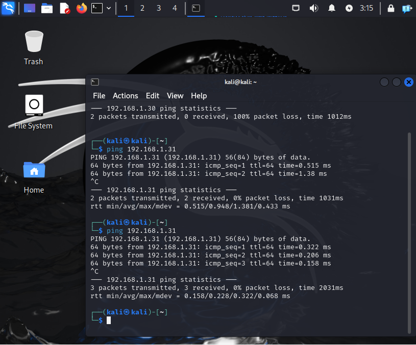
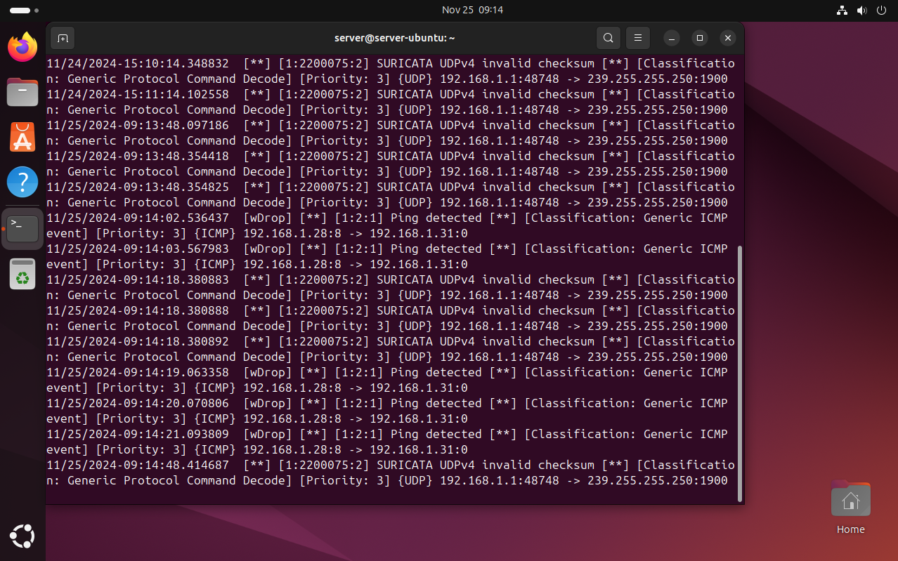
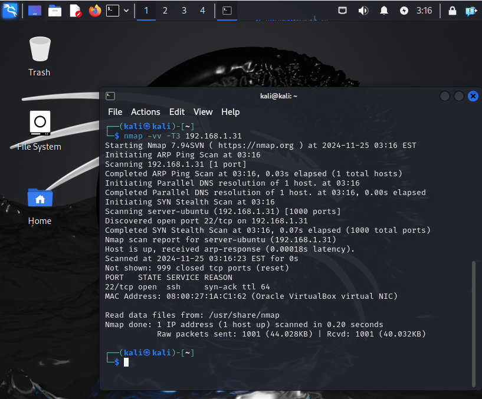
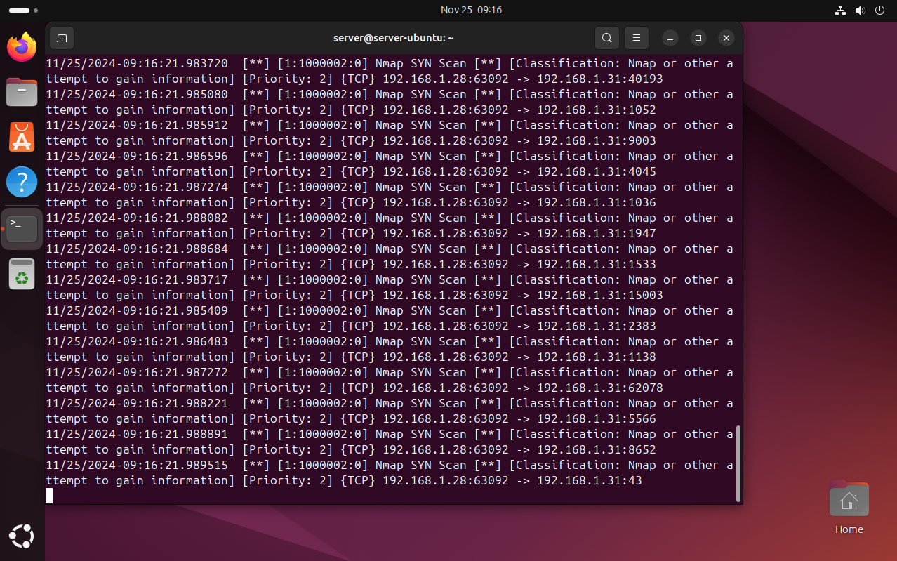
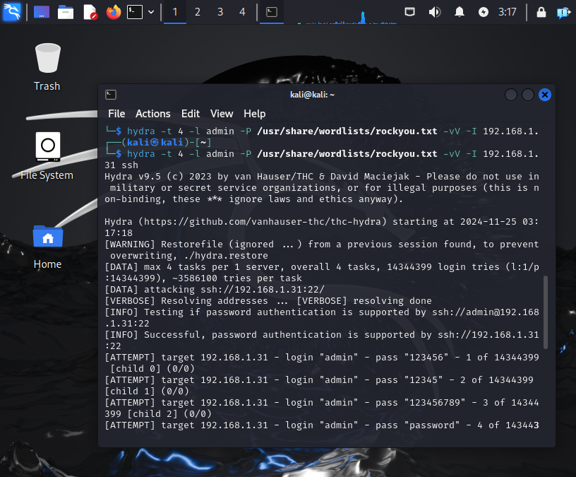
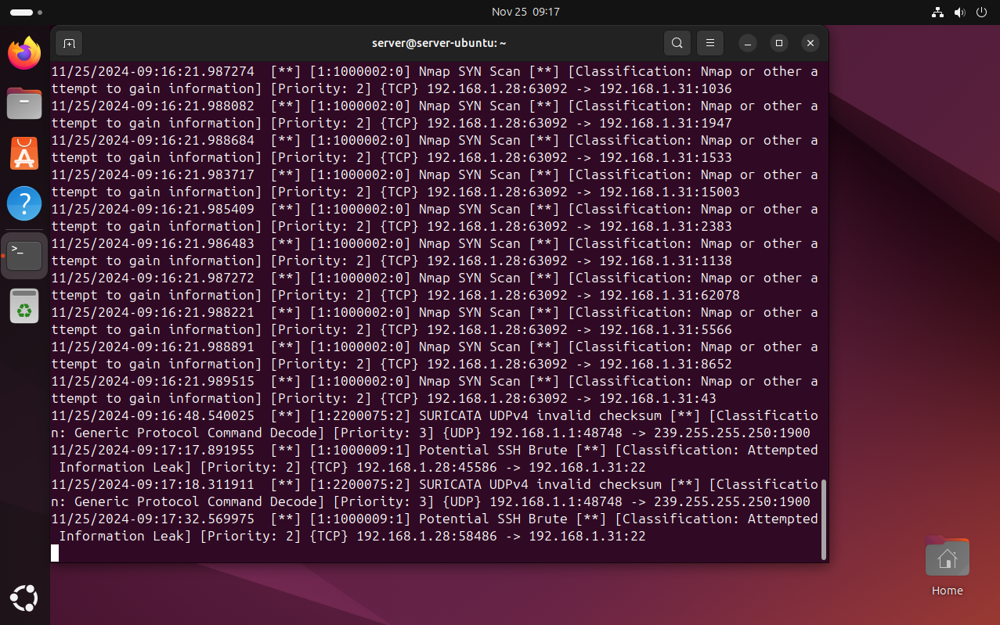

# Suricata
A small project to discover Suricata IDS/IPS.

See the blog post : https://jstnvltt.github.io/Portfolio/blog/deploying-suricata/

## Setup
To setup this project, I created with VirtualBox two machines : 
- one Ubuntu to be the server.
-  one Kali Linux to serve the role of attacker.
The two machines were updated and put on a bridge network setup to be able to communicate to each other.

I installed Suricata on the Ubuntu and configured some alert rules to detect unusual activity.

## Results
I focused on a special scenario where the attacker would ping the server, proceed to an nmap to look after open ports, then try to bruteforce ssh.

### Ping
The attacker is first pinging the Ubuntu server to see if it's available.

We correctly receive alerts on the file `/var/log/suricata/fast.log` by performing the command `tail -f /var/log/suricata/fast.log` : "Ping detected". As it's just pings, we evaluate these requests as low-importance priority.

### Nmap
The attacker wants now to know more about open ports and proceed to an Nmap with various parameters.

The defender correctly receives the attempt of discovering open ports with "Nmap SYN scan" messages, with medium-importance priority.

### Bruteforce with Hydra
Finally, the attacker wants to perform a bruteforce of the ssh connexion for the user "admin".

This bruteforce is correctly received as well by the server on several occasions, with medium-importance priority.

